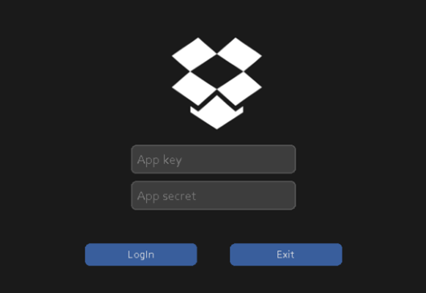

# DropboxCryptor

Safe file transfer for Dropbox.
  

## About The Project

---

This project provides secure file exchange for Dropbox cloud storage service. Project can
also be used as a team by creating Dropbox app on Dropbox App Console. These operations 
are over an interface to give the user a good experience. Project tried and tested by 
performing all the specified operations.

## Sample Program

---
**Dropbox Login Window :** This window for app_key and app_secret entries. Generating url label with using app_key and app_secret.

 
  

**Token Check Window :** Checking TOKEN and connect Dropbox account with given TOKEN.

  

**Dropbox Window :** A window for to perform on Dropbox transactions and view files in your account.

## Features

---
* ### [Dropbox API](operations/dropbox_operations)
    By establishing a two-way connection with the Dropbox API service;
  * [File upload](operations/dropbox_operations/upload_crypted_file.py)
  * [File deletion](operations/dropbox_operations/delete_file.py)
  * [File download](operations/dropbox_operations/download_decrypted_file.py)
  * [Listing files in dropbox account on interface](operations/dropbox_operations/list_files.py)

  operations done. Dropbox API uses OAuth2.0, to establish this two-way connection and 
issues access token to the user.

* ### [Database](operations/db_operations)
    MYSQL was used in database management and control of tests. The app_key and app_secret 
keys used for connection to the Dropbox API are saved in the database with a special id.
In the operations made at the Dropbox API, the files informations that match the id of 
this account, which is also saved into database are processed.

* ### [GUI](windows)
    While designing the GUI, python's tkinter package and the customtkinter UI library of 
this package were used to create a more modern looking interface. The purpose of using 
the Tkinter package is to be simple and easy to use.

* ### [File Encryption](operations/dropbox_operations/upload_crypted_file.py)
    To ensure the security of the files when uploading files to Dropbox, the files are 
encrypted before uploading. AES encryption standard was used for file encryption.The 
key to be used in AES encryption is randomly generated and saved in the database to 
match the file information, without being given to the user.
      

    In the file download process, after downloading the file, the key of the relevant 
file is retrieved from the database to decrypt the file and this password is used in 
the decrypt function.

* ### [File Discrepancy Check](operations/dropbox_operations/download_decrypted_file.py)
    The purpose of this process; at the processes of uploading the file to Dropbox and 
downloading it from Dropbox, it is to check whether the file has changed since the file
will change when an attack occurs to the network or the file.
    

  Downloaded file is hashed before it is decrypted.This hash value is compared with that 
of the uploaded encrypted file. If there is a difference between the two hashes, the 
file is not secure and this file is deleted from our local disk. If the hashes are the
same, means this file is safe, thereafter processes continues.

## References

* **Dropbox OAuth Guide and Flow Diagram** 

  * https://developers.dropbox.com/oauth-guide
    

* **Dropbox For Python**

  * https://www.dropbox.com/developers/documentation/python
  * https://practicaldatascience.co.uk/data-science/how-to-use-the-dropbox-api-with-python
    

* **MYSQL For Python**
  * https://dev.mysql.com/doc/connector-python/en/
    

* **tkinter**
  * https://docs.python.org/3/library/tkinter.html
    

* **customtkinter**
  * https://github.com/TomSchimansky/CustomTkinter
    

* **sha256**
  * https://docs.python.org/3/library/hashlib.html
    

* **AES**
  * https://pycryptodome.readthedocs.io/en/latest/src/cipher/aes.html